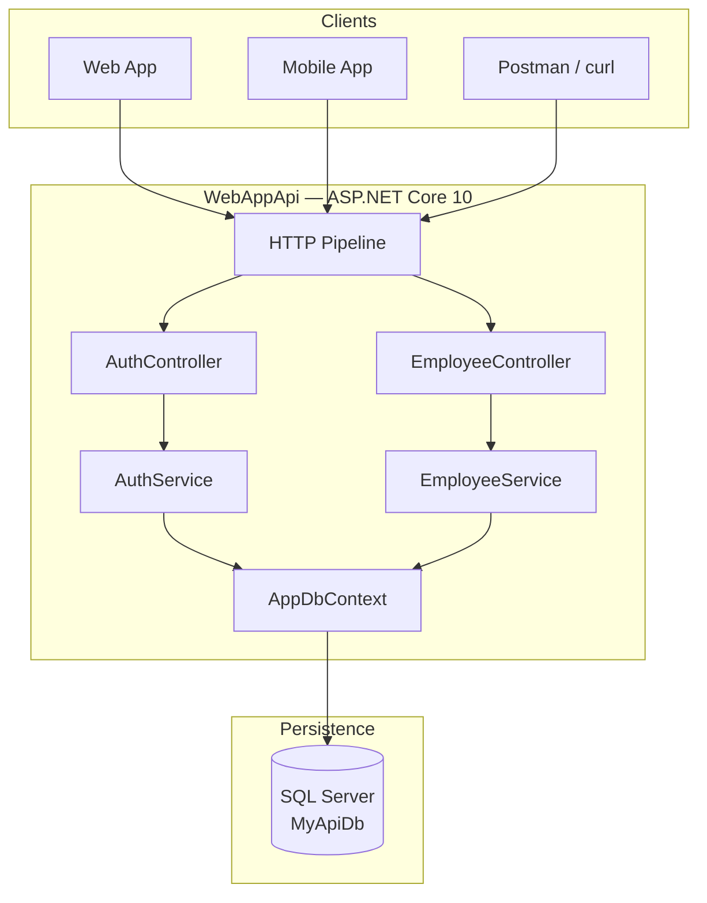
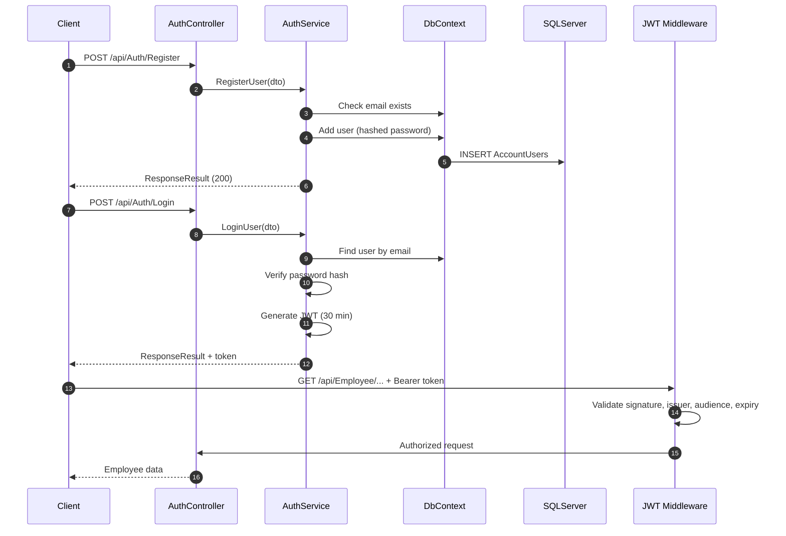
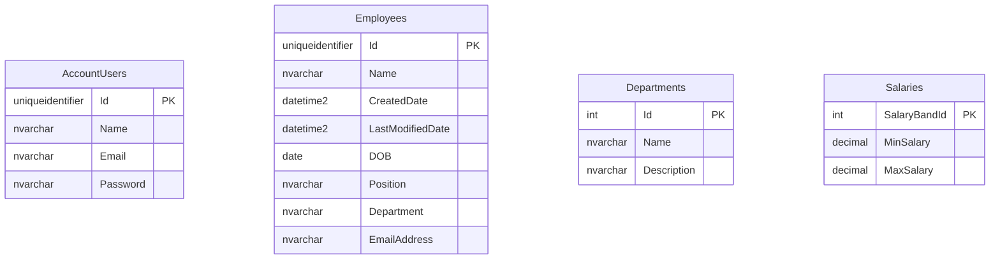

<div align="center">

# WebAppApi

**Secure REST API for user authentication and employee management**

ASP.NET Core 10 · Entity Framework Core · SQL Server · JWT Bearer

[](https://dotnet.microsoft.com/)
[](https://learn.microsoft.com/dotnet/csharp/)
[](https://learn.microsoft.com/aspnet/core/)
[](https://learn.microsoft.com/ef/core/)
[](https://www.microsoft.com/sql-server)
[](https://jwt.io/)
[](LICENSE)

**Repository:** [github.com/GiorgiKavtaradze-prog/WebAppApi](https://github.com/GiorgiKavtaradze-prog/WebAppApi)

[English](#overview) · [Quick Start](#quick-start) · [API Docs](#api-reference) · [Deploy](#deployment)

</div>

---

## Table of Contents

<details open>
<summary><strong>Click to expand full navigation</strong></summary>

### Getting Started
- [Overview](#overview)
- [Use Cases](#use-cases)
- [Features](#features)
- [Quick Start](#quick-start)
- [Prerequisites](#prerequisites)
- [Installation Guide](#installation-guide)

### Architecture & Design
- [Tech Stack](#tech-stack)
- [NuGet Packages](#nuget-packages)
- [Architecture](#architecture)
- [Middleware Pipeline](#middleware-pipeline)
- [Dependency Injection](#dependency-injection)
- [Data Model & ER Diagram](#data-model--er-diagram)
- [Response Format](#response-format)

### API Documentation
- [API Reference](#api-reference)
- [Auth Endpoints](#auth-endpoints-public)
- [Employee Endpoints](#employee-endpoints-jwt-required)
- [Complete Workflow Tutorial](#complete-workflow-tutorial)
- [HTTP Status Matrix](#http-status-matrix)
- [Error Messages Catalog](#error-messages-catalog)

### Configuration & Data
- [Configuration](#configuration)
- [Environment Variables](#environment-variables)
- [Authentication Deep Dive](#authentication-deep-dive)
- [Database & Migrations](#database--migrations)

### Development & Operations
- [Project Structure](#project-structure)
- [IDE Setup](#ide-setup)
- [Development Commands](#development-commands)
- [Testing the API](#testing-the-api)
- [Deployment](#deployment)
- [Troubleshooting & FAQ](#troubleshooting--faq)
- [Security Checklist](#security-checklist)
- [Roadmap](#roadmap)

### Community
- [Contributing](#contributing)
- [Changelog](#changelog)
- [License](#license)
- [Author](#author)

</details>

## Overview

**WebAppApi** is a production-style ASP.NET Core Web API designed as a backend for applications that need secure user accounts and employee record management. It follows a layered architecture pattern and exposes a small, focused surface area: two auth endpoints and five employee endpoints.

### Project Metadata

| Property | Value |
|----------|-------|
| **Author** | [GiorgiKavtaradze-prog](https://github.com/GiorgiKavtaradze-prog) |
| **Repository** | [GiorgiKavtaradze-prog/WebAppApi](https://github.com/GiorgiKavtaradze-prog/WebAppApi) |
| **Solution** | `WebAppApi.slnx` |
| **Main project** | `WebAppApi/WebAppApi.csproj` |
| **Target framework** | `net10.0` |
| **Database** | SQL Server (`MyApiDb`) |
| **Default HTTP port** | `5159` |
| **Default HTTPS port** | `7160` |
| **License** | MIT |


## Use Cases

| Scenario | How WebAppApi helps |
|----------|---------------------|
| **HR portal backend** | Store and manage employee profiles with authenticated access |
| **Internal admin tool** | Secure CRUD operations behind JWT login |
| **Learning project** | Demonstrates EF Core, JWT, service layer, and migrations |
| **Mobile app backend** | JSON REST API consumable from any HTTP client |
| **Portfolio project** | Shows modern .NET 10 stack and clean project structure |

---

## Features

### Core Capabilities

| # | Feature | Details |
|---|---------|---------|
| 1 | **User Registration** | Email uniqueness check, password hashing |
| 2 | **User Login** | JWT generation with 30-minute expiry |
| 3 | **Employee CRUD** | Full create, read, update, delete operations |
| 4 | **JWT Protection** | `[Authorize]` on all employee routes |
| 5 | **Unified Responses** | `ResponseResult<T>` envelope on every endpoint |
| 6 | **Auto Migrations** | Schema applied on startup via `Database.Migrate()` |
| 7 | **OpenAPI Spec** | Available at `/openapi/v1.json` in Development |
| 8 | **Password Security** | ASP.NET Core `PasswordHasher<T>` with rehash support |

### Design Patterns Used

- **Layered Architecture** — Controllers → Services → DbContext
- **Dependency Injection** — Scoped service registration in `Program.cs`
- **Repository-like access** — EF Core `DbContext` as data gateway
- **DTO Pattern** — Separate request/response models from entities
- **Generic Response Wrapper** — Consistent API contract

---

## Quick Start

> Get running in under 2 minutes.

```bash
# 1. Clone
git clone https://github.com/GiorgiKavtaradze-prog/WebAppApi.git
cd WebAppApi

# 2. Restore & run
dotnet restore WebAppApi.slnx
dotnet run --project WebAppApi/WebAppApi.csproj
```

**Requirements before running:**
- .NET 10 SDK installed
- SQL Server (or LocalDB) running
- Valid connection string in `WebAppApi/appsettings.json`

**Verify it's working:**

```bash
curl http://localhost:5159/openapi/v1.json
```

---

## Prerequisites

### Required Software

| Software | Minimum Version | Download |
|----------|-----------------|----------|
| .NET SDK | 10.0 | [dotnet.microsoft.com](https://dotnet.microsoft.com/download) |
| SQL Server | 2019+ or LocalDB | [microsoft.com/sql-server](https://www.microsoft.com/sql-server) |
| Git | 2.x | [git-scm.com](https://git-scm.com/) |

### Optional Tools

| Tool | Purpose |
|------|---------|
| Visual Studio 2022 | Full IDE with SQL tools |
| VS Code + C# Dev Kit | Lightweight development |
| JetBrains Rider | Cross-platform .NET IDE |
| Postman / Insomnia | API testing |
| Azure Data Studio | SQL Server management |

### Verify Installation

```bash
dotnet --version          # Expected: 10.x.x
dotnet ef --version       # EF Core CLI
sqlcmd -?                 # SQL Server command-line (optional)
```

### Windows — SQL Server LocalDB

If you use Visual Studio, LocalDB is often pre-installed:

```
Server=(localdb)\mssqllocaldb;Database=MyApiDb;Trusted_Connection=True;TrustServerCertificate=True;
```

---

## Installation Guide

### Step 1 — Clone Repository

```bash
git clone https://github.com/GiorgiKavtaradze-prog/WebAppApi.git
cd WebAppApi
```

### Step 2 — Configure Database

Open `WebAppApi/appsettings.json` and set your connection string:

```json
{
  "ConnectionStrings": {
    "MyConnection": "Server=localhost;Database=MyApiDb;TrustServerCertificate=True;Trusted_Connection=True;Encrypt=False;"
  }
}
```

<details>
<summary><strong>Alternative connection strings</strong></summary>

**SQL Server Express:**
```
Server=localhost\SQLEXPRESS;Database=MyApiDb;Trusted_Connection=True;TrustServerCertificate=True;
```

**LocalDB (Windows):**
```
Server=(localdb)\mssqllocaldb;Database=MyApiDb;Trusted_Connection=True;TrustServerCertificate=True;
```

**SQL Authentication:**
```
Server=localhost;Database=MyApiDb;User Id=sa;Password=YourPassword;TrustServerCertificate=True;
```

</details>

### Step 3 — Configure JWT (User Secrets recommended)

```bash
cd WebAppApi
dotnet user-secrets init
dotnet user-secrets set "JWT:Issuer" "webapp-client"
dotnet user-secrets set "JWT:Audience" "webapp-backend"
dotnet user-secrets set "JWT:Key" "04b83dfe0e9dadbc32f4354525b521412f0527beff39812c0dcf602aa1b5a648"
```

> Generate a new key for production. Key must be **64 hex characters** (32 bytes).

### Step 4 — Restore Dependencies

```bash
cd ..
dotnet restore WebAppApi.slnx
```

### Step 5 — Run

```bash
dotnet run --project WebAppApi/WebAppApi.csproj
```

Expected console output:

```
info: Microsoft.Hosting.Lifetime[14]
      Now listening on: http://localhost:5159
```

### Step 6 — Apply & Verify

Migrations run automatically. Test with:

```bash
curl -X POST http://localhost:5159/api/Auth/Register \
  -H "Content-Type: application/json" \
  -d "{\"name\":\"Test User\",\"email\":\"test@example.com\",\"password\":\"Test123!\"}"
```

---

## Tech Stack

| Category | Technology | Version |
|----------|------------|---------|
| Runtime | .NET | 10.0 |
| Language | C# | 13 |
| Web Framework | ASP.NET Core | 10.0 |
| ORM | Entity Framework Core | 10.0.5 |
| Database Provider | EF Core SQL Server | 10.0.5 |
| Authentication | JWT Bearer | 10.0.5 |
| API Documentation | Microsoft.AspNetCore.OpenApi | 10.0.4 |
| Password Hashing | ASP.NET Core Identity Hasher | Built-in |

---

## NuGet Packages

| Package | Version | Purpose |
|---------|---------|---------|
| `Microsoft.AspNetCore.Authentication.JwtBearer` | 10.0.5 | JWT validation middleware |
| `Microsoft.AspNetCore.OpenApi` | 10.0.4 | OpenAPI document generation |
| `Microsoft.EntityFrameworkCore` | 10.0.5 | ORM core |
| `Microsoft.EntityFrameworkCore.SqlServer` | 10.0.5 | SQL Server provider |
| `Microsoft.EntityFrameworkCore.Design` | 10.0.5 | Design-time migrations |
| `Microsoft.EntityFrameworkCore.Tools` | 10.0.5 | EF CLI tools |

---

## Architecture

### High-Level System Diagram



### Layer Responsibilities

| Layer | Folder | Responsibility |
|-------|--------|----------------|
| **Presentation** | `Controllers/` | HTTP routing, request validation, response mapping |
| **Application** | `Services/`, `IService/` | Business logic, orchestration |
| **Domain** | `Entities/` | Database entity models |
| **Infrastructure** | `Data/`, `Migrations/` | EF Core context, schema migrations |
| **Contracts** | `Dto/`, `GenericResponse/` | API input/output shapes |

### Authentication Sequence



---

## Middleware Pipeline

Request processing order in `Program.cs`:

```
Incoming Request
         │
         ▼
┌──────────────────┐
│ HTTPSRedirection │  (UseHttpsRedirection)
└────────┬─────────┘
         ▼
┌──────────────────┐
│  Authentication  │  (UseAuthentication — JWT Bearer)
└────────┬─────────┘
         ▼
┌──────────────────┐
│   Authorization  │  (UseAuthorization — [Authorize])
└────────┬─────────┘
         ▼
┌──────────────────┐
│   Controllers    │  (MapControllers)
└────────┬─────────┘
         ▼
    HTTP Response
```

| Middleware | When Active | Purpose |
|------------|-------------|---------|
| OpenAPI | Development only | Serves `/openapi/v1.json` |
| HTTPS Redirection | Always | Redirects HTTP → HTTPS |
| Authentication | Always | Validates JWT Bearer tokens |
| Authorization | Always | Enforces `[Authorize]` attributes |

---

## Dependency Injection

Registered in `Program.cs`:

| Service | Interface | Lifetime | Implementation |
|---------|-----------|----------|----------------|
| Database | — | Scoped | `AppDbContext` |
| Auth | `IAuthService` | Scoped | `AuthService` |
| Employee | `IEmployeeService` | Scoped | `EmployeeService` |
| JWT Auth | — | Singleton | `JwtBearerHandler` |

---

## Data Model & ER Diagram



### Table Details

#### `AccountUsers`

| Column | SQL Type | Nullable | Description |
|--------|----------|----------|-------------|
| `Id` | `uniqueidentifier` | No | Primary key (GUID) |
| `Name` | `nvarchar(max)` | Yes | Display name |
| `Email` | `nvarchar(max)` | Yes | Login email (should be unique) |
| `Password` | `nvarchar(max)` | Yes | Hashed password |

#### `Employees`

| Column | SQL Type | Nullable | Description |
|--------|----------|----------|-------------|
| `Id` | `uniqueidentifier` | No | Primary key (auto-generated) |
| `Name` | `nvarchar(max)` | Yes | Employee full name |
| `CreatedDate` | `datetime2` | Yes | Record creation timestamp |
| `LastModifiedDate` | `datetime2` | Yes | Last update timestamp |
| `DOB` | `date` | Yes | Date of birth |
| `Position` | `nvarchar(max)` | Yes | Job title |
| `Department` | `nvarchar(max)` | Yes | Department name (string) |
| `EmailAddress` | `nvarchar(max)` | Yes | Unique email per employee |

#### `Departments`

| Column | SQL Type | Nullable | Description |
|--------|----------|----------|-------------|
| `Id` | `int` (Identity) | No | Primary key |
| `Name` | `nvarchar(max)` | No | Department name |
| `Description` | `nvarchar(max)` | No | Department description |

#### `Salaries`

| Column | SQL Type | Nullable | Description |
|--------|----------|----------|-------------|
| `SalaryBandId` | `int` (Identity) | No | Primary key |
| `MinSalary` | `decimal(18,2)` | No | Minimum salary in band |
| `MaxSalary` | `decimal(18,2)` | No | Maximum salary in band |

> **Note:** `Departments` and `Salaries` tables exist in the schema but do not yet have dedicated API endpoints. Employee `Department` is stored as a free-text field.

---

## Response Format

Every endpoint returns `ResponseResult<T>`:

```json
{
  "data": {},
  "message": "Descriptive message",
  "status": true
}
```

### Field Reference

| Field | JSON Type | Description |
|-------|-----------|-------------|
| `data` | `object \| array \| string \| null` | Response payload; type varies by endpoint |
| `message` | `string` | Human-readable outcome description |
| `status` | `boolean` | `true` = operation succeeded; `false` = failed |

### Response Variants

**Success with data:**
```json
{
  "data": { "token": "eyJ...", "message": "Login Successfull" },
  "message": "Login Successfull",
  "status": true
}
```

**Failure with message only:**
```json
{
  "data": null,
  "message": "This User is already Exist, Please Register With New User!",
  "status": false
}
```

**Success with list:**
```json
{
  "data": [
    {
      "id": "3fa85f64-5717-4562-b3fc-2c963f66afa6",
      "name": "John Smith",
      "emailAddress": "john@company.com",
      "position": "Engineer",
      "department": "IT"
    }
  ],
  "message": "Employees Found",
  "status": false
}
```

> **Important:** Always inspect both HTTP status code **and** the `status` field. Some business failures return HTTP `200 OK` with `status: false`.

---

## API Reference

**Base URL (Development):** `http://localhost:5159`

**Content-Type:** `application/json` (all POST/PUT requests)

**Authentication header (protected routes):**
```http
Authorization: Bearer <jwt-token>
```

---

## Auth Endpoints (Public)

### `POST /api/Auth/Register`

Creates a new user account.

| | |
|---|---|
| **Auth required** | No |
| **Request body** | `UserDto` |
| **Success HTTP** | `200 OK` |

**Request:**

```json
{
  "name": "Jane Doe",
  "email": "jane@example.com",
  "password": "SecurePass123!"
}
```

**Success response:**

```json
{
  "data": null,
  "message": "User Registered Succesffully!",
  "status": true
}
```

**Failure response (duplicate email):**

```json
{
  "data": null,
  "message": "This User is already Exist, Please Register With New User!",
  "status": false
}
```

<details>
<summary><strong>curl / PowerShell examples</strong></summary>

**curl (bash):**
```bash
curl -X POST http://localhost:5159/api/Auth/Register \
  -H "Content-Type: application/json" \
  -d '{"name":"Jane Doe","email":"jane@example.com","password":"SecurePass123!"}'
```

**PowerShell:**
```powershell
Invoke-RestMethod -Uri "http://localhost:5159/api/Auth/Register" `
  -Method POST `
  -ContentType "application/json" `
  -Body '{"name":"Jane Doe","email":"jane@example.com","password":"SecurePass123!"}'
```

</details>

---

### `POST /api/Auth/Login`

Authenticates a user and returns a JWT token.

| | |
|---|---|
| **Auth required** | No |
| **Request body** | `UserDto` (email + password) |
| **Token lifetime** | 30 minutes |

**Request:**

```json
{
  "email": "jane@example.com",
  "password": "SecurePass123!"
}
```

**Success response (`200 OK`):**

```json
{
  "data": {
    "token": "eyJhbGciOiJkaXIiJhbGc...",
    "message": "Login Successfull"
  },
  "message": "Login Successfull",
  "status": true
}
```

**User not found (`404 Not Found`):**

```json
{
  "data": { "token": "", "message": "This User Not Exist, Please Login" },
  "message": "This User Not Exist, Please Login",
  "status": false
}
```

**Wrong password (`400 Bad Request`):**

```json
{
  "data": { "token": "", "message": "Password Incorrect" },
  "message": "Password Incorrect",
  "status": false
}
```

<details>
<summary><strong>curl / PowerShell examples</strong></summary>

**curl:**
```bash
curl -X POST http://localhost:5159/api/Auth/Login \
  -H "Content-Type: application/json" \
  -d '{"email":"jane@example.com","password":"SecurePass123!"}'
```

**PowerShell (save token):**
```powershell
$response = Invoke-RestMethod -Uri "http://localhost:5159/api/Auth/Login" `
  -Method POST -ContentType "application/json" `
  -Body '{"email":"jane@example.com","password":"SecurePass123!"}'

$token = $response.data.token
Write-Host "Token: $token"
```

</details>

---

## Employee Endpoints (JWT Required)

> All endpoints below require `Authorization: Bearer <token>` header.

---

### `GET /api/Employee/GetAllEmployees`

Returns all employee records.

| | |
|---|---|
| **Auth required** | Yes |
| **Parameters** | None |
| **Success HTTP** | `200 OK` |

**Success response:**

```json
{
  "data": [
    {
      "id": "3fa85f64-5717-4562-b3fc-2c963f66afa6",
      "name": "John Smith",
      "createdDate": "2026-03-28T10:00:00",
      "lastModifiedDate": null,
      "dob": "1990-05-15",
      "position": "Software Engineer",
      "department": "Engineering",
      "emailAddress": "john@company.com"
    }
  ],
  "message": "Employees Found",
  "status": false
}
```

**Empty list:**

```json
{
  "data": null,
  "message": "No Employees Found",
  "status": false
}
```

```bash
curl http://localhost:5159/api/Employee/GetAllEmployees \
  -H "Authorization: Bearer <TOKEN>"
```

---

### `GET /api/Employee/GetEmployeeById/{id}`

Retrieves a single employee by GUID.

| | |
|---|---|
| **Auth required** | Yes |
| **Route parameter** | `id` — GUID |

**Example:** `GET /api/Employee/GetEmployeeById/3fa85f64-5717-4562-b3fc-2c963f66afa6`

**Success response:**

```json
{
  "data": {
    "id": "3fa85f64-5717-4562-b3fc-2c963f66afa6",
    "name": "John Smith",
    "dob": "1990-05-15",
    "position": "Software Engineer",
    "department": "Engineering",
    "emailAddress": "john@company.com"
  },
  "message": "Data Not Found",
  "status": true
}
```

```bash
curl http://localhost:5159/api/Employee/GetEmployeeById/3fa85f64-5717-4562-b3fc-2c963f66afa6 \
  -H "Authorization: Bearer <TOKEN>"
```

---

### `POST /api/Employee/CreateEmployee`

Creates a new employee record.

| | |
|---|---|
| **Auth required** | Yes |
| **Request body** | `EmployeeDto` |
| **Unique constraint** | `emailAddress` must not already exist |

**Request:**

```json
{
  "name": "John Smith",
  "dob": "1990-05-15",
  "position": "Software Engineer",
  "department": "Engineering",
  "emailAddress": "john@company.com"
}
```

**Success:**

```json
{
  "data": null,
  "message": "employee Created Successfully!",
  "status": true
}
```

**Duplicate email:**

```json
{
  "data": null,
  "message": "Employee Already exist With same Email Id",
  "status": false
}
```

```bash
curl -X POST http://localhost:5159/api/Employee/CreateEmployee \
  -H "Content-Type: application/json" \
  -H "Authorization: Bearer <TOKEN>" \
  -d '{"name":"John Smith","dob":"1990-05-15","position":"Engineer","department":"IT","emailAddress":"john@company.com"}'
```

---

### `PUT /api/Employee/UpdateEmployee`

Updates an existing employee. Lookup is by `emailAddress`.

| | |
|---|---|
| **Auth required** | Yes |
| **Lookup key** | `emailAddress` in request body |
| **Partial update** | Empty fields retain existing values |

**Request:**

```json
{
  "name": "John Smith Updated",
  "emailAddress": "john@company.com",
  "position": "Senior Engineer",
  "department": "Engineering"
}
```

**Success:**

```json
{
  "data": null,
  "message": "employee Updated Successfully!",
  "status": true
}
```

**Not found:**

```json
{
  "data": null,
  "message": "Employee Not Exist With This Email Id",
  "status": false
}
```

```bash
curl -X PUT http://localhost:5159/api/Employee/UpdateEmployee \
  -H "Content-Type: application/json" \
  -H "Authorization: Bearer <TOKEN>" \
  -d '{"name":"John Updated","emailAddress":"john@company.com","position":"Senior Engineer"}'
```

---

### `DELETE /api/Employee/DeleteEmployee`

Deletes an employee by GUID.

| | |
|---|---|
| **Auth required** | Yes |
| **Query parameter** | `id` — GUID |

**Example:** `DELETE /api/Employee/DeleteEmployee?id=3fa85f64-5717-4562-b3fc-2c963f66afa6`

**Success:**

```json
{
  "data": null,
  "message": "Employee Deleted Successfully!",
  "status": false
}
```

```bash
curl -X DELETE "http://localhost:5159/api/Employee/DeleteEmployee?id=3fa85f64-5717-4562-b3fc-2c963f66afa6" \
  -H "Authorization: Bearer <TOKEN>"
```

---

## Complete Workflow Tutorial

End-to-end example from zero to full CRUD:

```bash
BASE=http://localhost:5159

# ── Step 1: Register ──────────────────────────────────
curl -s -X POST $BASE/api/Auth/Register \
  -H "Content-Type: application/json" \
  -d '{"name":"Admin User","email":"admin@company.com","password":"Admin123!"}'

# ── Step 2: Login & extract token ─────────────────────
TOKEN=$(curl -s -X POST $BASE/api/Auth/Login \
  -H "Content-Type: application/json" \
  -d '{"email":"admin@company.com","password":"Admin123!"}' \
  | jq -r '.data.token')

echo "Token: $TOKEN"

# ── Step 3: Create employee ───────────────────────────
curl -s -X POST $BASE/api/Employee/CreateEmployee \
  -H "Content-Type: application/json" \
  -H "Authorization: Bearer $TOKEN" \
  -d '{"name":"Alice Johnson","dob":"1988-03-20","position":"Developer","department":"Engineering","emailAddress":"alice@company.com"}'

# ── Step 4: List all employees ────────────────────────
curl -s $BASE/api/Employee/GetAllEmployees \
  -H "Authorization: Bearer $TOKEN" | jq

# ── Step 5: Update employee ───────────────────────────
curl -s -X PUT $BASE/api/Employee/UpdateEmployee \
  -H "Content-Type: application/json" \
  -H "Authorization: Bearer $TOKEN" \
  -d '{"name":"Alice Johnson","emailAddress":"alice@company.com","position":"Senior Developer"}'

# ── Step 6: Delete employee (replace GUID) ────────────
# curl -s -X DELETE "$BASE/api/Employee/DeleteEmployee?id=<GUID>" \
#   -H "Authorization: Bearer $TOKEN"
```

---

## HTTP Status Matrix

| Endpoint | Success | Not Found | Bad Request | Unauthorized |
|----------|---------|-----------|-------------|--------------|
| `POST /api/Auth/Register` | 200 | — | — | — |
| `POST /api/Auth/Login` | 200 | 404 | 400 | — |
| `GET /api/Employee/GetAllEmployees` | 200 | — | — | 401 |
| `GET /api/Employee/GetEmployeeById/{id}` | 200 | — | — | 401 |
| `POST /api/Employee/CreateEmployee` | 200 | — | — | 401 |
| `PUT /api/Employee/UpdateEmployee` | 200 | — | — | 401 |
| `DELETE /api/Employee/DeleteEmployee` | 200 | — | — | 401 |

---

## Error Messages Catalog

| Message | Endpoint | Cause |
|---------|----------|-------|
| `Please Fill All the Details!` | Login | Null request body |
| `This User Not Exist, Please Login` | Login | Email not registered |
| `Password Incorrect` | Login | Wrong password |
| `Login Successfull` | Login | Successful authentication |
| `This User is already Exist...` | Register | Duplicate email |
| `User Registered Succesffully!` | Register | Success |
| `No Employees Found` | GetAllEmployees | Empty table |
| `Employees Found` | GetAllEmployees | Records returned |
| `Employee Already exist With same Email Id` | CreateEmployee | Duplicate email |
| `employee Created Successfully!` | CreateEmployee | Success |
| `Employee Not Exist With This Email Id` | UpdateEmployee | Email not found |
| `employee Updated Successfully!` | UpdateEmployee | Success |
| `Employee Not Exist With This Id` | DeleteEmployee | GUID not found |
| `Employee Deleted Successfully!` | DeleteEmployee | Success |
| `Data Not Found` | GetEmployeeById | Missing or found record |

---

## Configuration

### appsettings.json

```json
{
  "Logging": {
    "LogLevel": {
      "Default": "Information",
      "Microsoft.AspNetCore": "Warning"
    }
  },
  "ConnectionStrings": {
    "MyConnection": "Server=localhost;Database=MyApiDb;TrustServerCertificate=True;Trusted_Connection=True;Encrypt=False;"
  },
  "JWT": {
    "Issuer": "your-client-id",
    "Audience": "your-backend-id",
    "Key": "<64-char-hex-key>"
  },
  "AllowedHosts": "*"
}
```

### Configuration Priority (highest first)

```
1. Environment variables     (JWT__Key, ConnectionStrings__MyConnection)
2. User Secrets              (Development only)
3. appsettings.{Environment}.json
4. appsettings.json
5. Command-line arguments
```

---

## Environment Variables

| Variable | Maps To | Example |
|----------|---------|---------|
| `ASPNETCORE_ENVIRONMENT` | Environment name | `Development`, `Production` |
| `ASPNETCORE_URLS` | Listen URLs | `http://+:8080` |
| `ConnectionStrings__MyConnection` | DB connection | `Server=...;Database=MyApiDb;...` |
| `JWT__Issuer` | Token issuer | `webapp-client` |
| `JWT__Audience` | Token audience | `webapp-backend` |
| `JWT__Key` | Signing key (hex) | `04b83dfe...` |

**Docker example:**

```bash
docker run -e ConnectionStrings__MyConnection="Server=db;..." \
           -e JWT__Key="your-hex-key" \
           -e ASPNETCORE_ENVIRONMENT=Production \
           -p 8080:8080 webappapi
```

---

## Authentication Deep Dive

### Token Structure

| Property | Value |
|----------|-------|
| Signing algorithm | HMAC-SHA256 |
| Encryption | AES-256-KW / AES-256-CBC-HMAC-SHA512 |
| Expiration | 30 minutes from issue |
| Storage | Client-side (localStorage, secure cookie, etc.) |

### JWT Claims

| Claim | Source | Example |
|-------|--------|---------|
| `ClaimTypes.Name` | User name | `Jane Doe` |
| `ClaimTypes.Email` | User email | `jane@example.com` |
| `ClaimTypes.NameIdentifier` | User GUID | `3fa85f64-5717-4562-b3fc-2c963f66afa6` |

### Password Hashing

- Uses `PasswordHasher<string>` from ASP.NET Core Identity
- Supports automatic rehash on login (`SuccessRehashNeeded`)
- Plain-text passwords are **never** stored

### Validation Parameters (Program.cs)

```csharp
ValidateIssuer = true
ValidateAudience = true
ValidateLifetime = true
ValidateIssuerSigningKey = true
ValidIssuer    → JWT:Issuer (config)
ValidAudience  → JWT:Audience (config)
IssuerSigningKey → JWT:Key (hex)
TokenDecryptionKey → JWT:Key (hex)
```

---

## Database & Migrations

### Migration History

| # | Migration ID | Date | Description |
|---|----------------|------|-------------|
| 1 | `20260328084353_dbinit` | 2026-03-28 | Creates `AccountUsers` and `Employees` |
| 2 | `20260418085310_add_department` | 2026-04-18 | Creates `Departments` |
| 3 | `20260418091347_add_salary_entity` | 2026-04-18 | Creates `Salaries` |

### EF Core Commands

```bash
cd WebAppApi

# Create new migration
dotnet ef migrations add AddNewFeature

# Apply to database
dotnet ef database update

# Remove last migration (if not applied)
dotnet ef migrations remove

# Generate SQL script
dotnet ef migrations script

# Drop database (destructive!)
dotnet ef database drop
```

### Startup Migration

On every application start, `Program.cs` executes:

```csharp
dbcontext.Database.Migrate();
```

Errors are caught and printed to console — the app continues running even if migration fails.

---

## Project Structure

```
WebAppApi/                              # Repository root
│
├── WebAppApi.slnx                      # Solution file (.NET 10 slnx format)
├── LICENSE                             # MIT License
├── README.md                           # This file
├── .gitignore                          # Git ignore rules
│
└── WebAppApi/                          # ASP.NET Core project
    │
    ├── Program.cs                      # App entry point, DI, middleware, migrations
    ├── WebAppApi.csproj                # Project file & NuGet references
    ├── appsettings.json                # Base configuration
    ├── appsettings.Development.json    # Development logging overrides
    ├── WebAppApi.http                  # REST Client request file
    │
    ├── Properties/
    │   └── launchSettings.json         # HTTP/HTTPS profiles & ports
    │
    ├── Controllers/
    │   ├── AuthController.cs           # POST Register, POST Login
    │   └── EmployeeController.cs       # CRUD endpoints [Authorize]
    │
    ├── Services/
    │   ├── AuthService.cs              # Login, Register, JWT generation
    │   └── EmployeeService.cs          # Employee business logic
    │
    ├── IService/
    │   ├── IAuthService.cs             # Auth service contract
    │   └── IEmployeeService.cs         # Employee service contract
    │
    ├── Data/
    │   └── AppDbContext.cs             # EF Core DbContext
    │
    ├── Entities/
    │   ├── User.cs                     # AccountUsers table
    │   ├── Employee.cs                 # Employees table
    │   ├── Department.cs               # Departments table
    │   └── Salary.cs                   # Salaries table
    │
    ├── Dto/
    │   ├── UserDto.cs                  # Auth request model
    │   ├── TokenDto.cs                 # Login response model
    │   └── EmployeeDto.cs              # Employee request/response model
    │
    ├── GenericResponse/
    │   └── ResponseResult.cs           # Unified API response wrapper
    │
    └── Migrations/
        ├── 20260328084353_dbinit.cs
        ├── 20260418085310_add_department.cs
        ├── 20260418091347_add_salary_entity.cs
        └── AppDbContextModelSnapshot.cs
```

---

## IDE Setup

### Visual Studio 2022

1. Open `WebAppApi.slnx`
2. Set `WebAppApi` as startup project
3. Select **https** launch profile
4. Press **F5** to run with debugger
5. Use **SQL Server Object Explorer** to inspect `MyApiDb`

### VS Code

1. Install extensions: **C# Dev Kit**, **REST Client**
2. Open folder: `WebAppApi/`
3. Terminal: `dotnet watch --project WebAppApi/WebAppApi.csproj`
4. Open `WebAppApi.http` and send requests

### JetBrains Rider

1. Open `WebAppApi.slnx`
2. Run configuration: **WebAppApi → https**
3. Use built-in HTTP Client or `.http` file

---

## Development Commands

```bash
# ── Build ──────────────────────────────────────────────
dotnet build WebAppApi.slnx
dotnet build WebAppApi.slnx --configuration Release

# ── Run ────────────────────────────────────────────────
dotnet run --project WebAppApi/WebAppApi.csproj
dotnet run --project WebAppApi/WebAppApi.csproj --launch-profile https

# ── Watch (hot reload) ─────────────────────────────────
dotnet watch --project WebAppApi/WebAppApi.csproj

# ── Clean ──────────────────────────────────────────────
dotnet clean WebAppApi.slnx

# ── Publish ──────────────────────────────────────────
dotnet publish WebAppApi/WebAppApi.csproj -c Release -o ./publish

# ── User Secrets ─────────────────────────────────────
dotnet user-secrets list --project WebAppApi
dotnet user-secrets set "JWT:Key" "your-key" --project WebAppApi
```

---

## Testing the API

### Option 1 — curl / PowerShell

See [Complete Workflow Tutorial](#complete-workflow-tutorial).

### Option 2 — REST Client (.http file)

Open `WebAppApi/WebAppApi.http` in VS Code or Rider.

### Option 3 — Postman

1. Create environment variable `baseUrl` = `http://localhost:5159`
2. Create environment variable `token` = (empty initially)
3. **Register** → **Login** → copy token to `token` variable
4. Set collection auth: Bearer `{{token}}`
5. Test employee endpoints

### Option 4 — OpenAPI

```bash
# Download spec
curl http://localhost:5159/openapi/v1.json -o openapi.json
```

Import `openapi.json` into Swagger UI, Postman, or Insomnia.

### Automated Tests

> Currently no unit/integration test project is included. Recommended additions:
> - `WebAppApi.Tests` with xUnit
> - Integration tests using `WebApplicationFactory`
> - Auth flow end-to-end tests

---

## Deployment

### Publish for Production

```bash
dotnet publish WebAppApi/WebAppApi.csproj \
  -c Release \
  -o ./publish \
  --self-contained false
```

### IIS (Windows Server)

1. Install [.NET 10 Hosting Bundle](https://dotnet.microsoft.com/download/dotnet/10.0)
2. Publish to folder
3. Create IIS site pointing to publish folder
4. Set environment variables for `JWT__*` and connection string
5. Ensure SQL Server is accessible from the server

### Azure App Service

1. Create App Service (Windows or Linux, .NET 10)
2. Configure Connection String in **Configuration → Connection strings**
3. Add Application Settings: `JWT__Issuer`, `JWT__Audience`, `JWT__Key`
4. Deploy via GitHub Actions, Azure DevOps, or `az webapp deploy`

### Environment Checklist for Production

- [ ] Set `ASPNETCORE_ENVIRONMENT=Production`
- [ ] Move secrets to Azure Key Vault / environment variables
- [ ] Enable HTTPS only
- [ ] Set `RequireHttpsMetadata = true`
- [ ] Use managed identity or secure SQL connection
- [ ] Configure application logging (Application Insights, Serilog)
- [ ] Set up health checks (recommended addition)

---

## Troubleshooting & FAQ

### Common Problems

| Problem | Solution |
|---------|----------|
| **Cannot connect to SQL Server** | Verify server is running; test with `sqlcmd -S localhost -E` |
| **401 on Employee routes** | Login first; include `Authorization: Bearer <token>` header |
| **401 immediately after login** | JWT Issuer/Audience/Key mismatch between token creation and validation config |
| **Migration fails on startup** | Run `dotnet ef database update` manually; check console error |
| **Port already in use** | Change port in `launchSettings.json` or kill conflicting process |
| **Duplicate email on register** | Use a different email address |
| **Token expired** | Login again (tokens expire after 30 minutes) |

### FAQ

**Q: Why does GetAllEmployees return `status: false` when employees exist?**
A: Current controller implementation uses `ResponseResult.Failure()` for the success path. Check the `data` field for the employee list.

**Q: Are Department and Salary entities accessible via API?**
A: Not yet. Tables exist in the database schema but dedicated endpoints are planned (see [Roadmap](#roadmap)).

**Q: Can I use PostgreSQL instead of SQL Server?**
A: Replace `UseSqlServer()` with `UseNpgsql()` and update the NuGet package. Schema migrations would need regeneration.

**Q: How do I change token expiration time?**
A: Modify `Expires = DateTime.UtcNow.AddMinutes(30)` in `AuthService.GetJwtToken()`.

**Q: Is Swagger UI included?**
A: OpenAPI JSON is available at `/openapi/v1.json` in Development. Swagger UI can be added via `Swashbuckle.AspNetCore` package.

---

## Security Checklist

### Before Production

- [ ] Remove hardcoded JWT key from `appsettings.json`
- [ ] Remove hardcoded JWT key from `AuthService.cs` (use `IConfiguration` injection)
- [ ] Align JWT Issuer/Audience between token creation and validation
- [ ] Set `RequireHttpsMetadata = true`
- [ ] Enforce HTTPS redirection in production
- [ ] Use Azure Key Vault or similar for secrets
- [ ] Enable SQL connection encryption
- [ ] Add rate limiting on `/api/Auth/*` endpoints
- [ ] Add CORS policy if consumed by browser clients
- [ ] Review and restrict `AllowedHosts`
- [ ] Enable structured logging and monitoring

---

## Roadmap

Planned enhancements for future versions:

| Priority | Feature | Status |
|----------|---------|--------|
| 🔴 High | Fix JWT Issuer/Audience config consistency | Planned |
| 🔴 High | Move JWT key to configuration injection in AuthService | Planned |
| 🟡 Medium | Department CRUD endpoints | Planned |
| 🟡 Medium | Salary CRUD endpoints | Planned |
| 🟡 Medium | Swagger UI integration | Planned |
| 🟡 Medium | Unit & integration tests | Planned |
| 🟢 Low | Role-based authorization (`[Authorize(Roles = "...")]`) | Planned |
| 🟢 Low | Pagination for GetAllEmployees | Planned |
| 🟢 Low | Health check endpoint (`/health`) | Planned |
| 🟢 Low | Docker support (`Dockerfile`) | Planned |

---

## Contributing

Contributions, issues, and feature requests are welcome.

### How to Contribute

1. **Fork** the repository
2. **Create** a feature branch:
   ```bash
   git checkout -b feature/amazing-feature
   ```
3. **Commit** your changes:
   ```bash
   git commit -m "feat: add amazing feature"
   ```
4. **Push** to your fork:
   ```bash
   git push origin feature/amazing-feature
   ```
5. **Open** a Pull Request against `main`

### Commit Message Convention

| Prefix | Usage |
|--------|-------|
| `feat:` | New feature |
| `fix:` | Bug fix |
| `docs:` | Documentation only |
| `refactor:` | Code change without feature/fix |
| `test:` | Adding tests |
| `chore:` | Build, CI, dependencies |

### Code Standards

- Keep controllers thin — business logic in services
- Return `ResponseResult<T>` from all endpoints
- Use `async/await` for database operations
- Follow existing folder structure and naming conventions
- Add XML comments for public APIs (recommended)

---

## Changelog

### [Unreleased]

- Initial project rename from MyFirstApi to WebAppApi
- Comprehensive README documentation
- MIT License added

### [1.0.0] — 2026-03-28

- Initial database schema (`AccountUsers`, `Employees`)
- JWT authentication (Register, Login)
- Employee CRUD with authorization
- EF Core migrations with auto-apply on startup

---

## License

This project is licensed under the **MIT License**.

See [LICENSE](LICENSE) for the full text.

```
Copyright (c) 2026 Giorgi Kavtaradze
```

---

## Author

<table>
  <tr>
    <td>
      <strong>Giorgi Kavtaradze</strong><br/>
      GitHub: <a href="https://github.com/GiorgiKavtaradze-prog">@GiorgiKavtaradze-prog</a><br/>
      Repository: <a href="https://github.com/GiorgiKavtaradze-prog/WebAppApi">WebAppApi</a>
    </td>
  </tr>
</table>

---

<div align="center">

**If this project helped you, consider giving it a ⭐ on GitHub!**

<br/>

**[⬆ Back to top](#webappapi)**

<br/>

Built with ❤️ using **ASP.NET Core 10**

</div>
